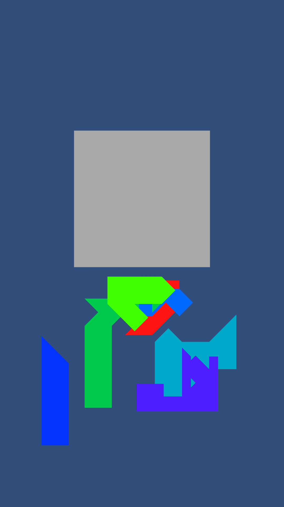
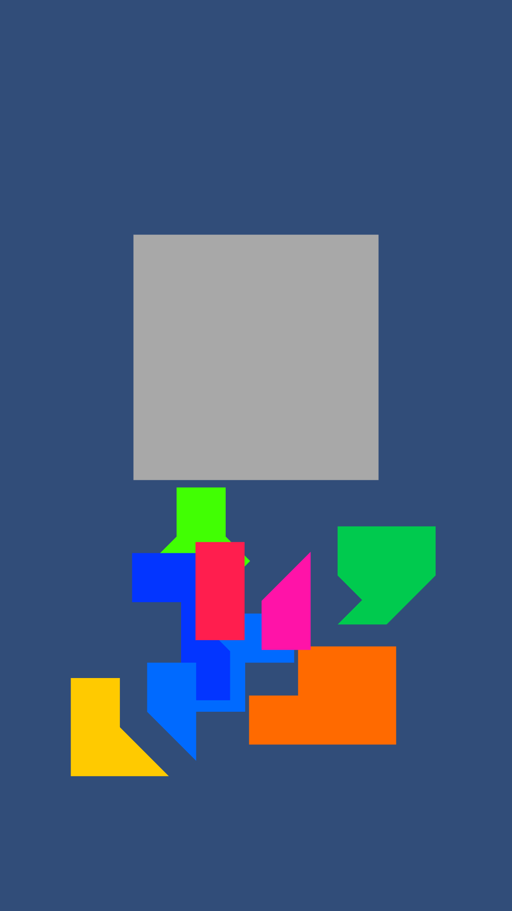
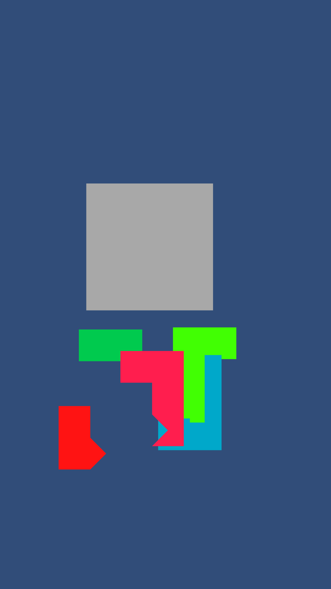
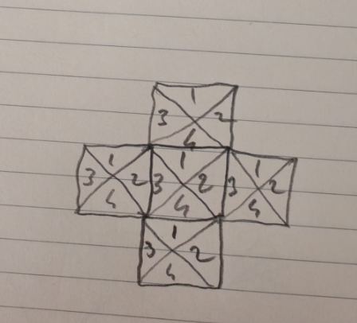

# PuzzleForge 🧩

**A procedural "fill-the-grid" puzzle for Unity — every level is a different, always-solvable
triangle-tiling.**

PuzzleForge generates a grid, partitions it into coloured shapes, scatters those shapes around
the board, and asks the player to drag them back so they tile the grid exactly. The generator
is the interesting part: it guarantees full grid coverage and a valid solution *by
construction*, and a run is fully reproducible from a single seed.

It is a **playable vertical slice + reference implementation**, not a shipping game — there is
no audio, no menu, and the UI is a single "level complete" panel. See
[Known Limitations](#-known-limitations).

- Unity **2022.3 LTS** (developed on 2022.3.62f3), built-in render pipeline, C# 9
- ~2.7k lines of runtime C# across 28 files, plus EditMode + PlayMode test suites

---

## 🎥 Demos

| Easy (4×4) | Medium (5×5) | Hard (6×6) |
|---|---|---|
|  |  |  |

---

## 🚀 Run it

```bash
git clone https://github.com/kocyunus/puzzleforge.git
```

Open the folder in Unity Hub (2022.3.x), open `Assets/Scenes/Game.unity`, press Play.
Package resolution and the Test Framework come from the committed `Packages/manifest.json`.

---

## 🎮 How it plays

1. A grey **board** (the target grid) sits in the middle; the generated **shapes** are
   scattered above it.
2. Click a shape, drag it over the board.
3. Release near the matching slots — if every triangle of the shape lines up with a free,
   same-orientation board slot, it snaps into place.
4. Place all shapes (they tile the board exactly) → the level-complete panel appears →
   **Next Level** generates a fresh one.

Input is mouse-only, through the legacy `Input` manager.

---

## 🧭 Runtime flow

```
GameBootstrap (Awake)
  └─ registers services on the ServiceLocator:
       IColorPalette   → DistinctColorPalette (from the ColorPaletteSO on GameBootstrap)
       IPrefabPooler   → PrefabPoolerService
       IShapeScatter   → ShapeScatterService

LevelManager.Start()  ── coroutine ──────────────────────────────────────────────
  1. Load Assets/levels.json  (local TextAsset, or UnityWebRequest with local fallback)
  2. Select a level            (random of Selected Difficulty, or Specific Level Id)
  3. LevelGenerator.GenerateLevel(level)
       ├─ GridBuilder.BuildGrid()            → W×H cells × 4 triangles (the play grid)
       ├─ ShapeGenerator.GenerateShapes()    → partition the grid into `shapeCount` shapes
       └─ IShapeScatter.Scatter(...)         → lay the shapes out in a band above the board
  4. PuzzleBoard.Initialize(level)
       └─ builds a SECOND identical grid (the grey "solution grid"), sets totalPiecesNeeded

DragTriangleParentInput  (per drag-release)
  └─ SnapUtil.TrySnapToBoard(...)  → on success PuzzleBoard.OnShapePlaced()

PuzzleBoard.IsPuzzleComplete  (every board slot isSnapped)
  └─ LevelCompleteUI.Show()
```

---

## 🏗️ Project layout

### Assemblies

| Assembly | Contents |
|---|---|
| `PuzzleForge.Runtime` | everything under `Assets/_scripts/Runtime/` (refs `Unity.Mathematics`, `PuzzleForge.Generation.Seeding`) |
| `PuzzleForge.Generation.Seeding` | just `SeedCellSelector` — a pure, engine-light leaf assembly so it can be unit-tested directly |
| `PuzzleForge.Tests.EditMode` | `SeedCellSelectorTests` |
| `PuzzleForge.Tests.PlayMode` | `ShapeGenerationTests`, `SnapTests` (drive the real `GridBuilder` / `ShapeGenerator` / `SnapUtil`) |

### Scripts

```
Assets/_scripts/Runtime/
├── Composition/   GameBootstrap, ServiceLocator
├── Core/          IService / ITickable / IPrefabPool(er) / IShapeScatter, GameLog
├── Data/          ColorPaletteSO  (Create ▸ Game ▸ Color Palette)
├── Domain/        IColorPalette, Rgba, DistinctColorPalette
├── Gameplay/
│   ├── Boards/       PuzzleBoard          (solution grid + win state)
│   ├── Components/   Triangle, ShapeData, TriangleMeshRenderer, SimpleTriangleColor.shader
│   ├── Input/        DragTriangleParentInput
│   └── Snapping/     SnapUtil
├── Generation/
│   ├── Grid/         GridBuilder
│   ├── Seeding/      SeedCellSelector     (own assembly)
│   └── Shapes/       ShapeGenerator, NeighborSelector
├── Level/         LevelData, LevelGenerator, LevelManager
├── Services/      PrefabPoolerService, ShapeScatterService, (DistinctColorPalette)
└── Ui/            LevelCompleteUI

Assets/Tests/{EditMode,PlayMode}/
```

### Scene (`Assets/Scenes/Game.unity`)

| Group | Objects |
|---|---|
| `---Systems` | **GameBootstrap**, **LevelManager**, **LevelGenerator** |
| `---Cameras` | Main Camera |
| `---Gameplay` | **PuzzleBoard** |
| `---Ui` | LevelCompleteUI, Panel, TMP text, EventSystem |
| `---Input` | **DragInput** (`DragTriangleParentInput`) |

### Prefabs (`Assets/prefab/`)

| Prefab | Used by | Notes |
|---|---|---|
| `Triangle.prefab` | `LevelGenerator` | playable piece triangle — `Triangle` + `TriangleMeshRenderer` + `PolygonCollider2D` |
| `BGTriangle.prefab` | `PuzzleBoard` | same components; used as a grey board slot |
| `ShapePrefab.prefab` | `LevelGenerator` | shape root — carries `ShapeData` only |

---

## 🧠 Generation algorithm

### Grid structure

Each cell is a square of **4 triangles** keyed by `posIndex`:



```
posIndex   1 = Up (↑)   2 = Right (→)   3 = Left (←)   4 = Down (↓)
```

`GridBuilder` spawns `W × H` cells (each dimension clamped to **4–6**), so a grid has
`W × H × 4` triangles — 64 to 144. `GridBuilder.TriangleRegistry` is a
`Dictionary<long, Triangle>` keyed by `(x, y, posIndex)` for O(1) lookup.

### 1 · Seed placement — `SeedCellSelector.Select(...)`

```csharp
public static List<Vector2Int> Select(
    int gridWidth, int gridHeight, int shapeCount,
    int minCellDistance, bool preSeedCorners, System.Random rng)
```

Pure function, no `MonoBehaviour`. **Guarantee: it always returns exactly
`min(shapeCount, gridWidth * gridHeight)` distinct, in-bounds cells.**

1. Pre-seed up to 4 corners.
2. Greedy *far-first* fill: repeatedly take the candidate (from edge/centre cells, phase-
   alternating) that is `minCellDistance` (Chebyshev) from everything chosen and maximises the
   distance to the nearest chosen cell.
3. If the grid can't fit that many at `minCellDistance`, **relax** the distance step by step
   (`d, d-1, … 0`).
4. Last resort: take any remaining free cell.

This is what fixed the old lock-up: the previous inline picker could return a short list and
`GenerateShapes` then indexed past the end and threw, aborting the load.

### 2 · Turn-based growth — `ShapeGenerator.GrowShapes()`

Each seed becomes a `ShapeData`; its seed triangle goes on a `Queue<Triangle>` frontier.
Shapes take turns; each expands up to `MovesPerTurn` (`rng.Next(1, 3)`) triangles per round:

```csharp
while (anyProgress && unownedCount > 0)
  foreach (shape)
    repeat MovesPerTurn times, while the frontier is non-empty:
      current = shape.GrowthQueue.Dequeue()
      if NeighborSelector.TryPickNext(current, shape, grid, minTrianglesPerBox, rng, out picked)
         || TryGrowFromAnyOwned(shape, current, out picked):
             ClaimTriangle(picked, shape);   shape.GrowthQueue.Enqueue(picked)
```

Ownership is a field — `Triangle.ownerShapeIndex` (`-1` = unowned) — plus a running
`unownedCount`, so `ClaimTriangle` is O(1). There is no per-move rebuild of an "unowned pool".

### 3 · Neighbour selection — `NeighborSelector.TryPickNext(...)`

A 3-priority chain, all reads via `grid.TryGetTriangle(x, y, pos, out t)` (O(1)) + a bounds
check:

| Priority | Rule |
|---|---|
| **1 — same cell** | fill the current cell up to `minTrianglesPerBox` before spreading; prefer a position adjacent to the current one |
| **2 — adjacent cell** | step into a neighbour cell through a matching *door*: the exit position in the current cell must be owned, the entry position in the neighbour must be empty. Prefers fully-empty neighbour cells; `rng` breaks ties |
| **3 — any owned cell** | fill any empty position in a cell the shape already owns (rule ignored) |

Door pairing: Up(1)↔Down(4), Right(2)↔Left(3).

### 4 · Coverage guarantee — `ShapeGenerator.EnsureFullCoverage()`

After growth, any still-unowned triangle is claimed by a BFS from the owned frontier (a
triangle's neighbours = its 3 same-cell siblings + the one triangle it faces in the adjacent
cell). The triangle graph is connected and every shape has a seed, so this **always drives
`unownedCount` to 0** — 100% coverage, disjoint partition, by construction. (A forced fallback
to `Shapes[0]` + a warning stays as unreachable defence.)

### Determinism

Everything the generator randomises — seed placement, `MovesPerTurn`, the priority-2
tie-break, and `IColorPalette.Shuffle` / the HSV colour fallback — draws from the single
`System.Random` passed to `ShapeGenerator`. Nothing in generation touches `UnityEngine.Random`.
**Same seed ⇒ byte-for-byte identical `ownerShapeIndex` *and* colour assignment across the
whole grid.** (Only `ShapeScatterService` — where the pieces start on screen — stays
deliberately random; it's cosmetic and never affects the puzzle.)

### Why the puzzle is always solvable

`PuzzleBoard` builds a grid **identical** to the generation grid. The shapes are a disjoint
partition of that grid, so each shape has exactly one correct placement and together they tile
the board with no gaps or overlaps. A solution therefore exists for every generated level;
placing all `shapeCount` shapes fills the board.

---

## 🎯 Snap-to-grid — `SnapUtil.TrySnapToBoard(...)`

Called from `DragTriangleParentInput.EndDrag`. All-or-nothing, then greedy:

1. **Gate** — every triangle of the dragged shape must have a **same-`posIndex`** board slot
   within `SnapDistance` (5 world units; triangle spacing is 10). Any miss → abort, the shape
   stays where it was dropped.
2. Collect all `(shapeTri, boardTri)` pairs within the threshold, sorted nearest-first.
3. **Greedy assign** — closest pair first, no slot double-booked. If not *every* triangle gets
   a slot, abort.
4. Reject if any target slot is already `isSnapped`.
5. **Commit** — move each shape triangle onto its slot's world XY, `RegisterBoardTriangle` on
   the `ShapeData`, flag both sides `isSnapped`, and `PuzzleBoard.OnShapePlaced()`.

`PuzzleBoard.IsPuzzleComplete` then checks that **every board slot is `isSnapped`** (not just a
piece count).

Picking a placed shape back up (`TryBeginDrag`) calls `OnShapeRemoved` + `ResetAllSnaps`, so
you can freely rearrange — there is no undo stack.

---

## 🎨 Rendering — `TriangleMeshRenderer`

No sprites or external art. Each triangle builds a 3-vertex, double-sided `Mesh` at runtime,
writes vertex colours, and pushes its colour through a `MaterialPropertyBlock` into the
`Custom/SimpleTriangleColor` shader — so recolouring never instantiates a material.

---

## 🔧 Configuration

### `Assets/levels.json`

Ids are `level-1` … `level-9`, three per difficulty (easy 4×4, medium 5×5, hard 6×6):

```json
{
  "levelId": "level-7",
  "difficulty": "hard",
  "gridWidth": 6,
  "gridHeight": 6,
  "shapeCount": 10,
  "minTrianglesPerBox": 3,
  "seedMinCellDistance": 1
}
```

`LevelData.IsValid()` enforces: grid **4–6**, `shapeCount` **5–12**, `minTrianglesPerBox`
**2–4**, `seedMinCellDistance` **1–3**.

| Field | Effect |
|---|---|
| `gridWidth` / `gridHeight` | grid size in cells |
| `shapeCount` | number of shapes (= pieces to place to win) |
| `minTrianglesPerBox` | how full a cell gets before a shape spreads — higher = chunkier shapes |
| `seedMinCellDistance` | preferred spacing between seeds; relaxed automatically if the grid can't fit that many |

### `LevelManager` (Inspector)

| Field | Effect |
|---|---|
| **Local Json File** | `levels.json` `TextAsset` — default source and fallback |
| **Download From Server** / **Server Url** | fetch `levels.json` over HTTP, falling back to the local file on any failure |
| **Selected Difficulty** | `easy` / `medium` / `hard` — a random level of that tier |
| **Specific Level Id** | non-empty overrides the random pick |

### Colours

Assign a `ColorPaletteSO` (Create ▸ *Game ▸ Color Palette*) to **GameBootstrap ▸ Color
Palette**; it is converted to `Rgba[]` and registered as `DistinctColorPalette`. With no
palette, `ShapeGenerator` falls back to random vivid HSV colours (seeded from its `rng`).

---

## 🧪 Tests

Runtime code lives in `PuzzleForge.Runtime` so the test assemblies can reference it.
Run via **Window ▸ General ▸ Test Runner** (EditMode / PlayMode ▸ *Run All*), or:

```bash
Unity -batchmode -runTests -testPlatform EditMode -projectPath . -logFile -
Unity -batchmode -runTests -testPlatform PlayMode -projectPath . -logFile -
```

| Suite | Mode | Asserts |
|---|---|---|
| `SeedCellSelectorTests` | EditMode | `Select(...)` returns exactly `min(shapeCount, cells)` distinct in-bounds cells for **every** `levels.json` config (regression for the lock-up), plus min-distance-when-it-fits, clamping when `shapeCount > cells`, determinism, and degenerate inputs |
| `ShapeGenerationTests` | PlayMode | for every level config (and the two that used to crash): **100% coverage**, shapes are a **disjoint partition**, `ownerShapeIndex` agrees with each shape, and a fixed seed reproduces the exact per-triangle ownership *and* colour assignment |
| `SnapTests` | PlayMode | `SnapUtil.TrySnapToBoard`: the all-or-nothing gate, `posIndex` matching, occupied-slot rejection, and the commit (triangles moved onto slots, both sides flagged) |

The PlayMode suites drive the real `GridBuilder` / `ShapeGenerator` / `SnapUtil` through a
minimal fake `IPrefabPool` (or plain `GameObject`s).

### Logging

Routine trace goes through `GameLog.Info(...)` — **off by default**; set `GameLog.Verbose =
true` or define `GAMELOG_VERBOSE`. Warnings and errors always print.

---

## 📖 Extending

**New neighbour rule** — add a method to `NeighborSelector`, slot it into the `TryPickNext`
chain, run `ShapeGenerationTests` to confirm coverage + partition still hold.

**New difficulty tier** — add `levels.json` entries with a new `difficulty` string (within the
`IsValid()` ranges), point **LevelManager ▸ Selected Difficulty** at it.

**Async generation** — `LevelGenerator.GenerateLevel()` is synchronous; move it to a coroutine
and `yield` between grid build / growth / scatter for a progress bar.

---

## 🐛 Known limitations

- **UI** — a single level-complete panel; no menu, HUD, difficulty picker, or pause.
- **No audio.**
- **No move history** — shapes can be picked up and re-placed, but there's no undo.
- **Single player.**
- **Legacy input** — mouse only, via the old `Input` manager (not the Input System).
- **No game feel** — snapping is instant, no tween / particles / sound.
- **Scatter is intentionally random** — where pieces start on screen is not seeded; it's
  cosmetic and never affects the puzzle.

---

## 📄 License

MIT — see `LICENSE`.

---

**Unity:** 2022.3 LTS (tested on 2022.3.62f3) · **C#:** 9 · **Render pipeline:** built-in
